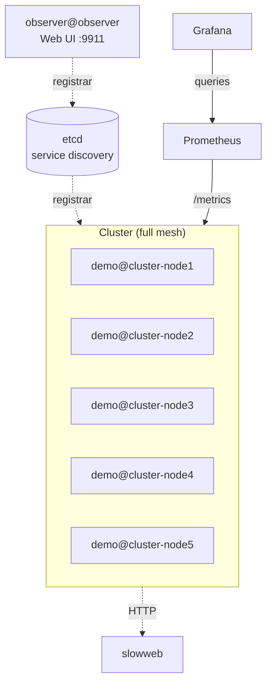

# Observability Example

A demo project that shows how to monitor an Ergo Framework cluster in production. Five
nodes run realistic workloads while three observability layers provide full visibility:

- **Grafana dashboards** -- Prometheus metrics collected by the [Radar](https://docs.ergo.services/extra-library/applications/radar) application on each node. Two dashboards: **Ergo Cluster** (processes, mailbox latency, network, events, logging, system) and **Slowweb HTTP Metrics** (custom application metrics with request rate, error rate, duration percentiles)
- **Observer web UI** -- real-time process inspection, application trees, and network topology
- **AI-powered diagnostics** -- an MCP server on cluster-node1 exposes 46 tools to Claude Code (or any MCP-compatible AI client), turning it into an interactive SRE that investigates the cluster through natural language conversation

## Scenario Applications

Each node runs four scenario applications that exercise different aspects of the framework metrics.

### Latency (`apps/latency`)

Generates mailbox latency spikes. A sender sends bursts of messages to a remote worker.
The worker makes an HTTP call to the `slowweb` service (3-15ms delay) for every message,
blocking the mailbox and creating measurable latency. The worker also registers custom
Prometheus metrics (request rate and duration histogram) exposed on the Slowweb dashboard.

### Messaging (`apps/messaging`)

Generates network traffic with variable payload sizes. A sender sends bursts of messages
with random payloads (256 bytes to 10 KB) to a pool of workers on a remote node. Workers
receive and discard the payloads.

### Lifecycle (`apps/lifecycle`)

Generates process spawn/terminate churn. A SOFO supervisor continuously starts children
that terminate after a random delay and get restarted, creating constant process activity.
A separate `zombie_maker` actor creates one zombie process per node -- a child whose
callback never returns, useful for testing zombie detection.

### Events (`apps/events`)

Populates all five event utilization states. Per node: 20 publishers and 300 subscribers,
distributed across categories:

| Category | Behavior |
|----------|----------|
| active | Publishing with subscribers -- normal operation |
| idle | Registered but no publishes, no subscribers |
| no_subscribers | Publishing but nobody is listening |
| on_demand | Starts publishing only when the first subscriber appears |
| no_publishing | Subscribers waiting but producer never publishes |

### Logging

All scenario apps produce log messages at different levels (debug, info, warning, error).
Node log level is set to `debug`. Default logger is disabled, colored logger is enabled.

## Architecture



Each node runs the same set of applications:
- `radar` -- Prometheus metrics exporter (`/metrics`, `/health/live`, `/health/ready`)
- `mcp` -- MCP server (cluster-node1 only exposes port 9922)
- `latency_scenario`, `messaging_scenario`, `lifecycle_scenario`, `events_scenario`

A separate `observer` node joins the cluster and provides a web UI on port 9911
for real-time process inspection, application trees, and network topology.

Nodes start sequentially via Docker healthcheck dependencies:
cluster-node1 -> cluster-node2 -> cluster-node3 -> cluster-node4 -> cluster-node5.

## Requirements

- Docker and Docker Compose

## Quick Start

```bash
make up
```

| Service    | URL                          | Credentials   |
|------------|------------------------------|---------------|
| Grafana    | http://localhost:8888         | admin / ergo  |
| Prometheus | http://localhost:9091         |               |
| Observer   | http://localhost:9911         |               |
| MCP        | http://localhost:9922/mcp     |               |

Open Grafana, navigate to the **Ergo Cluster** dashboard.
Open Observer for real-time process inspection, application trees, and network topology.

## Commands

```bash
make up       # Build images and start all services
make down     # Stop all services
make restart  # Stop and start
make logs     # Follow logs from all containers
make status   # Show container status
make clean    # Remove containers, images, and volumes
```

## AI-Powered Cluster Diagnostics (MCP)

Besides Grafana dashboards with historical metrics, this example demonstrates real-time
interactive diagnostics via MCP (Model Context Protocol). The MCP application on cluster-node1
exposes 46 tools covering processes, network, events, logging, debug profiling, and
real-time samplers. Combined with the `ergo-devops` agent, Claude Code becomes an
interactive SRE that investigates the cluster through conversation.

The MCP server acts as a cluster proxy -- every tool accepts an optional `node` parameter.
When specified, the request is forwarded to the remote node via native Ergo inter-node
protocol. One MCP endpoint provides access to all 5 nodes.

### Setup

#### 1. Start the cluster

```bash
make up
```

Wait until all 5 nodes are healthy (1-2 minutes).

#### 2. Connect MCP server

**Claude Code:**

```bash
claude mcp add --transport http demo-cluster http://localhost:9922/mcp
```

**Cursor:**

Add to `.cursor/mcp.json` (project-level) or `~/.cursor/mcp.json` (global):

```json
{
  "mcpServers": {
    "demo-cluster": {
      "url": "http://localhost:9922/mcp"
    }
  }
}
```

#### 3. Allow MCP tools (Claude Code)

Edit `~/.claude/settings.json` and add the `mcp__demo-cluster` permission prefix:

```json
{
  "permissions": {
    "allow": [
      "mcp__demo-cluster"
    ]
  }
}
```

Without this, Claude Code will ask for confirmation on every tool call.

#### 4. Install ergo-devops agent and skill (Claude Code)

```bash
git clone https://github.com/ergo-services/claude.git /tmp/ergo-claude
mkdir -p ~/.claude/agents ~/.claude/skills
cp /tmp/ergo-claude/agents/ergo-devops.md ~/.claude/agents/
cp -r /tmp/ergo-claude/skills/ergo-devops ~/.claude/skills/
rm -rf /tmp/ergo-claude
```

#### 5. Verify

Start Claude Code and try any prompt from the [Try It](#try-it) section below.

### Try It

#### Cluster overview

```
check cluster health on demo-cluster
```

Discovers all nodes, returns a comparison table: uptime, process counts, memory,
goroutines, error/panic logs.

```
show me inter-node traffic on demo-cluster
```

Shows messages in/out, bytes transferred, connection uptime for every peer link.
Helps spot unbalanced traffic or flapping connections.

```
list all applications running on demo@cluster-node3
```

Shows all 7 applications with their mode, uptime, and process counts.

```
compare memory usage across all nodes on demo-cluster
```

Compares heap_alloc, heap_sys, goroutine count, GC cycles, and GC CPU percentage
across all nodes.

```
show log message counts by level for all nodes on demo-cluster
```

Presents a table with debug/info/warning/error/panic counts per node -- useful
for spotting error storms.

#### Process diagnostics

```
find all zombie processes on demo-cluster
```

Finds one zombie per node -- the `lifecycle.zombieChild` stuck in
`processPayloadDecompression`. Reports PIDs, parent processes, and uptime.

```
show me the stack trace of the zombie process on demo@cluster-node1
```

Displays the goroutine dump with `processPayloadDecompression` visible in the
stack (preserved by `//go:noinline`).

```
which processes have the deepest mailboxes on demo-cluster?
```

During latency bursts, `latency_worker` processes appear with queued messages
and measurable mailbox latency.

```
which processes have the highest utilization on demo-cluster?
```

Finds `lifecycle_sup` with high RunningTime/Uptime ratio due to continuous
spawn/terminate churn.

```
are there any restart loops on demo-cluster?
```

Finds recently spawned `lifecycle.child` processes -- expected behavior from the
SOFO supervisor with permanent restart strategy.

```
show me the process tree of lifecycle_scenario on demo@cluster-node1
```

Displays the full supervision tree: application -> supervisor -> workers, with
uptime and state for each process.

#### Network traffic

```
show me inter-node traffic on demo-cluster
```

Returns messages in/out, bytes transferred, connection uptime, and pool size for
every peer link. Helps spot unbalanced traffic or dead connections.

```
is demo@cluster-node4 connected to all other nodes?
```

Compares discovered vs connected nodes and reports any missing connections.

```
show connection details between demo@cluster-node1 and demo@cluster-node3
```

Returns protocol version, pool size, connection uptime, and per-connection byte
counters.

```
which node pair has the highest message throughput?
```

Aggregates messages in/out across all peer pairs and ranks by total throughput.

```
check registrar status on demo-cluster
```

Shows the etcd registrar state, connected endpoints, and cluster name. Verifies
that service discovery is operational.

#### Event system

```
show me the event system health on demo-cluster
```

Groups events by utilization state (active, idle, no_subscribers, on_demand,
no_publishing) and reports the distribution.

```
are there any events publishing to void on demo-cluster?
```

Finds evt_12, evt_13, evt_14 -- publishers that produce messages with zero
subscribers by design.

```
which events have the most subscribers on demo-cluster?
```

Finds evt_0..evt_9 with 40-60 subscribers each -- the active events from the
events scenario.

```
are there events with subscribers but no publishing on demo-cluster?
```

Finds evt_17, evt_18, evt_19 -- events with 10-17 waiting subscribers but zero
publications.

```
show me details of evt_0 on demo@cluster-node1
```

Returns the producer PID, subscriber list, publication count, and delivery
statistics.

```
capture events from evt_0 on demo@cluster-node1 for 30 seconds
```

Starts a passive sampler that captures every publication in real time.

#### Performance

```
investigate mailbox latency spikes on demo-cluster
```

During latency bursts, `latency_worker` processes show measurable latency --
the agent correlates mailbox depth, drain ratio, and running time to identify
the root cause.

```
which processes have the highest drain ratio on demo-cluster?
```

High drain means the process handles many messages per wakeup -- indicates burst
processing under load.

```
show me GC pressure across all nodes on demo-cluster
```

Compares gc_cpu_percent, last_gc_pause, heap_alloc, and num_gc across the cluster.

```
profile heap allocations on demo@cluster-node2
```

Returns top allocators sorted by cumulative bytes -- useful for finding
memory-heavy code paths.

```
show goroutine count across all nodes on demo-cluster
```

Compares goroutine counts -- a growing count indicates a goroutine leak, stable
count means healthy.

```
inspect latency_worker on demo@cluster-node2, it seems overloaded
```

Shows mailbox depth, drain ratio, running time, links, monitors, and
actor-specific internal state. Correlates metrics to diagnose whether the worker
keeps up with incoming bursts.

#### Real-time monitoring

```
start monitoring node health on demo-cluster every 10 seconds for 5 minutes
```

Starts an active sampler that periodically collects node info. Results are stored
in a ring buffer (default 256 entries). The agent reads them incrementally to
detect trends in process counts, memory, and error rates.

```
track top 5 mailbox hotspots on demo-cluster every 2 seconds for 1 minute
```

Builds a timeline of mailbox pressure -- shows latency bursts coming and going
as senders alternate targets.

```
poll the goroutine of latency_worker on demo@cluster-node1 until it wakes up
```

Sleeping processes park their goroutine so it is not visible in a single dump.
The sampler retries until the process wakes up and the goroutine becomes visible.

```
watch runtime stats on demo@cluster-node3 for 10 minutes, use buffer size 512
```

Larger buffer retains more history for long-running sessions. Reports heap growth
rate, GC frequency, and goroutine count trends.

```
capture error and panic logs from demo-cluster for 1 minute
```

Starts a passive sampler that captures log messages by level as they are emitted.
Finds lifecycle child termination errors and zombie maker messages.

```
subscribe to evt_0 on demo@cluster-node1 for 30 seconds
```

Captures every event publication in real time.

```
capture warning logs and evt_5 events on demo@cluster-node1 for 1 minute, buffer 1024
```

Captures both log messages and event publications in a single sampler with a
custom buffer size.

```
show me all active samplers on demo-cluster
```

Lists all running samplers with their status, remaining time, and buffer usage.

```
read new results from sampler <id> since sequence 5
```

Incremental read -- returns only entries newer than the given sequence number.

```
stop sampler <id>
```

Stops a running sampler. Buffered results remain readable until the sampler
process terminates.
