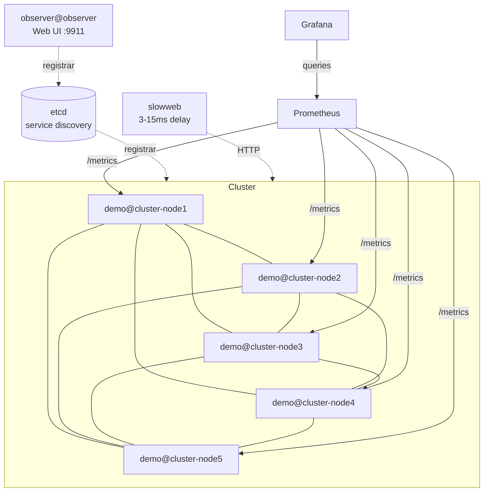

# Observability Example

This example demonstrates Ergo Framework's built-in observability stack: a 5-node cluster
running realistic workloads with Prometheus metrics collection and pre-configured Grafana dashboards.

## Overview

Five Ergo nodes form a cluster via etcd service discovery. Each node runs four scenario
applications that generate different types of load. The `radar` application on each node
exports Prometheus metrics. Grafana visualizes everything on two dashboards:

- **Ergo Cluster** -- built-in framework metrics (processes, mailbox latency, network, events, logging, system)
- **Slowweb HTTP Metrics** -- custom application metrics (HTTP request rate, error rate, duration percentiles)

Metrics covered:

- Process count, spawn/terminate rate, zombie processes
- Mailbox latency -- max, distribution, top stressed processes
- Process utilization -- running time, wakeup rate, drains per wakeup
- Network messaging -- message throughput, byte rate, per-node and per-link breakdown
- Event system -- registered events, publish/delivery rate, utilization states, subscriber counts
- Logging -- message rate by level (debug, info, warning, error)
- System -- CPU time, memory (OS and runtime)

## Scenario Applications

### Latency (`apps/latency`)

Generates mailbox latency spikes via HTTP-blocking message processing.

Each node runs a `latency_worker` (registered name, discoverable via application map) and a
`latency_sender`. The sender resolves remote nodes through the registrar and sends bursts
of 100 `MessagePing` messages to a remote worker. The worker makes an HTTP call to the
`slowweb` service (3-15ms delay) for every message, blocking the mailbox and creating
measurable latency. Bursts repeat every 1-5 seconds, alternating target nodes round-robin.

Supervised by an OFO (One For One) supervisor with permanent restart strategy.

### Messaging (`apps/messaging`)

Generates network traffic with variable payload sizes.

Each node runs a `messaging_sender` and a `messaging_pool` (3 workers, `act.Pool`). The pool
is registered in the application map for remote discovery. The sender resolves remote nodes,
picks one round-robin, and sends a burst of 100-1000 `MessagePayload` messages with random
payloads (256-9996 bytes, generated via `lib.RandomString`). Bursts repeat every 1-10 seconds.
Workers receive and discard the payloads.

Supervised by an OFO supervisor with permanent restart strategy.

### Lifecycle (`apps/lifecycle`)

Generates process spawn/terminate churn and a zombie process.

A SOFO (Simple One For One) supervisor starts 10-100 children 3 seconds after launch. Each
child sleeps 0-1 second during init (simulating variable initialization time), then schedules
its own termination after 1-30 seconds with an abnormal reason. The supervisor restarts them
permanently (intensity 1000 per 5 seconds), creating continuous spawn/terminate activity.

A separate `zombie_maker` actor spawns a child process, sends it a `messageBlock` that causes
it to enter `select{}` inside `processPayloadDecompression` (marked `//go:noinline` for
readable stack traces). After 2 seconds the maker kills the blocked child via `Node().Kill()`.
The child becomes a zombie because its callback never returns.

### Events (`apps/events`)

Populates all event utilization states with publishers and subscribers.

Per node: 20 publishers and 300 subscribers. Publishers are started first, subscribers 5 seconds
later (so events are registered on all nodes before subscription begins).

**Publishers** (per node):
| Index | Category | Behavior |
|-------|----------|----------|
| 0-9 | active | Publish every 1-5s, have subscribers |
| 10-11 | idle | No publishing, no subscribers |
| 12-14 | no_subscribers | Publish every 1-5s, nobody subscribes |
| 15-16 | on_demand | Start publishing only when first subscriber appears (`EventOptions.Notify`) |
| 17-19 | no_publishing | Never publish, have subscribers waiting |

**Subscribers** (per node):
| Index | Count | Behavior |
|-------|-------|----------|
| 0-199 | 200 | Monitor 1-3 random local events (evt_0..9) |
| 200-259 | 60 | Monitor 1 local + 1-2 random remote events (evt_0..9) |
| 260-299 | 40 | Monitor evt_17..19 (no_publishing events) |

### Logging

Log messages are distributed across all scenario apps at different levels:

| Level | Source | Frequency |
|-------|--------|-----------|
| debug | Messaging workers (each message), event publishers (each publish), event subscribers (each event) | High |
| info | Startup messages, burst summaries, supervisor batch starts | Low |
| warning | Lifecycle child before termination, zombie maker kill | Medium |
| error | Lifecycle child termination reason, zombie maker "not responding" | Medium |

Node log level is set to `debug`. Default logger is disabled, colored logger is enabled.

## Architecture



Each node runs the same set of applications:
- `radar` -- Prometheus metrics exporter (`/metrics`, `/health/live`, `/health/ready`)
- `mcp` -- MCP server (cluster-node1 only exposes port 9922)
- `latency_scenario`, `messaging_scenario`, `lifecycle_scenario`, `events_scenario`

A separate `observer` node joins the cluster and provides a web UI on port 9911
for real-time process inspection, application trees, and network topology.

Nodes start sequentially via Docker healthcheck dependencies:
cluster-node1 -> cluster-node2 -> cluster-node3 -> cluster-node4 -> cluster-node5.

## Requirements

- Docker and Docker Compose

## Quick Start

```bash
make up
```

| Service    | URL                          | Credentials   |
|------------|------------------------------|---------------|
| Grafana    | http://localhost:8888         | admin / ergo  |
| Prometheus | http://localhost:9091         |               |
| Observer   | http://localhost:9911         |               |
| MCP        | http://localhost:9922/mcp     |               |

Open Grafana, navigate to the **Ergo Cluster** dashboard.
Open Observer for real-time process inspection, application trees, and network topology.

## Commands

```bash
make up       # Build images and start all services
make down     # Stop all services
make restart  # Stop and start
make logs     # Follow logs from all containers
make status   # Show container status
make clean    # Remove containers, images, and volumes
```

## AI-Powered Cluster Diagnostics (MCP)

Besides Grafana dashboards with historical metrics, this example demonstrates real-time
interactive diagnostics via MCP (Model Context Protocol). The MCP application on cluster-node1
exposes 46 tools covering processes, network, events, logging, debug profiling, and
real-time samplers. Combined with the `ergo-devops` agent, Claude Code becomes an
interactive SRE that investigates the cluster through conversation.

The MCP server acts as a cluster proxy -- every tool accepts an optional `node` parameter.
When specified, the request is forwarded to the remote node via native Ergo inter-node
protocol. One MCP endpoint provides access to all 5 nodes.

### Setup

#### 1. Start the cluster

```bash
make up
```

Wait until all 5 nodes are healthy (1-2 minutes).

#### 2. Connect MCP server

**Claude Code:**

```bash
claude mcp add --transport http demo-cluster http://localhost:9922/mcp
```

**Cursor:**

Add to `.cursor/mcp.json` (project-level) or `~/.cursor/mcp.json` (global):

```json
{
  "mcpServers": {
    "demo-cluster": {
      "url": "http://localhost:9922/mcp"
    }
  }
}
```

#### 3. Allow MCP tools (Claude Code)

Edit `~/.claude/settings.json` and add the `mcp__demo-cluster` permission prefix:

```json
{
  "permissions": {
    "allow": [
      "mcp__demo-cluster"
    ]
  }
}
```

Without this, Claude Code will ask for confirmation on every tool call.

#### 4. Install ergo-devops agent and skill (Claude Code)

From the Ergo Framework repository root:

```bash
mkdir -p ~/.claude/agents ~/.claude/skills

# agent -- interactive SRE diagnostics
cp claude/agents/ergo-devops.md ~/.claude/agents/

# skill -- quick reference playbooks, invoked via /ergo-devops
cp -r claude/skills/ergo-devops ~/.claude/skills/
```

#### 5. Verify

Start Claude Code and type:

```
check cluster health on demo-cluster
```

The agent discovers all 5 nodes via `cluster_nodes`, calls `node_info` on each, and
reports a summary table with process counts, uptime, and memory usage.

### Try It

#### Cluster overview

```
check cluster health on demo-cluster
```

Discovers all nodes, calls `node_info` and `app_list` on each in parallel. Returns
a comparison table: uptime, process counts, memory, goroutines, error/panic logs.

```
show me inter-node traffic on demo-cluster
```

Calls `network_nodes` -- shows messages in/out, bytes transferred, connection uptime
for every peer link. Helps spot unbalanced traffic or flapping connections.

```
list all applications running on demo@cluster-node3
```

Calls `app_list node=demo@cluster-node3`. Shows all 7 applications with their mode,
uptime, and process counts.

```
compare memory usage across all nodes on demo-cluster
```

Calls `runtime_stats` on each node in parallel. Compares heap_alloc, heap_sys,
goroutine count, GC cycles, and GC CPU percentage.

```
show log message counts by level for all nodes on demo-cluster
```

Calls `node_info` on each node, extracts LogMessages counters. Presents a table
with debug/info/warning/error/panic counts per node -- useful for spotting error storms.

#### Process diagnostics

```
find all zombie processes on demo-cluster
```

Calls `process_list state=zombee` on each node. Finds one zombie per node -- the
`lifecycle.zombieChild` stuck in `processPayloadDecompression`. Reports PIDs, parent
processes, and uptime.

```
show me the stack trace of the zombie process on demo@cluster-node1
```

Calls `pprof_goroutines pid=<zombie_pid>`. Displays the goroutine dump with
`processPayloadDecompression` visible in the stack (preserved by `//go:noinline`).

```
which processes have the deepest mailboxes on demo-cluster?
```

Calls `process_list sort_by=mailbox limit=10` on each node. During latency bursts,
`latency_worker` processes appear with queued messages and measurable mailbox latency.

```
which processes have the highest utilization on demo-cluster?
```

Calls `process_list sort_by=running_time limit=10` on each node. Finds `lifecycle_sup`
with high RunningTime/Uptime ratio due to continuous spawn/terminate churn.

```
are there any restart loops on demo-cluster?
```

Calls `process_list max_uptime=10 limit=50` on each node. Finds recently spawned
`lifecycle.child` processes -- expected behavior from the SOFO supervisor with
permanent restart strategy.

```
show me the process tree of lifecycle_scenario on demo@cluster-node1
```

Calls `process_children parent=lifecycle_scenario recursive=true`. Displays the
full supervision tree: application -> supervisor -> workers, with uptime and state
for each process.

#### Network traffic

```
show me inter-node traffic on demo-cluster
```

Calls `network_nodes`. Returns messages in/out, bytes transferred, connection uptime,
and pool size for every peer link. Helps spot unbalanced traffic or dead connections.

```
is demo@cluster-node4 connected to all other nodes?
```

Calls `cluster_nodes node=demo@cluster-node4` and `network_nodes node=demo@cluster-node4`.
Compares discovered vs connected nodes and reports any missing connections.

```
show connection details between demo@cluster-node1 and demo@cluster-node3
```

Calls `network_node_info name=demo@cluster-node3 node=demo@cluster-node1`. Returns
protocol version, pool size, connection uptime, and per-connection byte counters.

```
which node pair has the highest message throughput?
```

Calls `network_nodes` on each node in parallel, aggregates messages in/out across
all peer pairs, and ranks by total throughput.

```
check registrar status on demo-cluster
```

Calls `registrar_info`. Shows the etcd registrar state, connected endpoints, and
cluster name. Verifies that service discovery is operational.

#### Event system

```
show me the event system health on demo-cluster
```

Calls `event_list` on each node in parallel. Groups events by utilization state
(active, idle, no_subscribers, on_demand, no_publishing) and reports the distribution.

```
are there any events publishing to void on demo-cluster?
```

Calls `event_list utilization_state=no_subscribers` on each node. Finds evt_12,
evt_13, evt_14 -- publishers that produce messages with zero subscribers by design.

```
which events have the most subscribers on demo-cluster?
```

Calls `event_list sort_by=subscribers limit=10` on each node. Finds evt_0..evt_9
with 40-60 subscribers each -- the active events from the events scenario.

```
are there events with subscribers but no publishing on demo-cluster?
```

Calls `event_list utilization_state=no_publishing` on each node. Finds evt_17,
evt_18, evt_19 -- events with 10-17 waiting subscribers but zero publications.

```
show me details of evt_0 on demo@cluster-node1
```

Calls `event_info name=evt_0 node=demo@cluster-node1`. Returns the producer PID,
subscriber list, publication count, and delivery statistics.

```
capture events from evt_0 on demo@cluster-node1 for 30 seconds
```

Calls `sample_listen event=evt_0 duration_sec=30 node=demo@cluster-node1`. Starts
a passive sampler that captures every publication in real time. Read results with
`sample_read` to see the actual event payloads.

#### Performance

```
investigate mailbox latency spikes on demo-cluster
```

Calls `process_list sort_by=mailbox_latency limit=10` on each node. During latency
bursts, `latency_worker` processes show measurable latency -- the agent correlates
mailbox depth, drain ratio, and running time to identify the root cause.

```
which processes have the highest drain ratio on demo-cluster?
```

Calls `process_list sort_by=drain limit=10` on each node. High drain means the
process handles many messages per wakeup -- indicates burst processing under load.

```
show me GC pressure across all nodes on demo-cluster
```

Calls `runtime_stats` on each node in parallel. Compares gc_cpu_percent,
last_gc_pause, heap_alloc, and num_gc across the cluster.

```
profile heap allocations on demo@cluster-node2
```

Calls `pprof_heap node=demo@cluster-node2`. Returns top allocators sorted by
cumulative bytes -- useful for finding memory-heavy code paths.

```
show goroutine count across all nodes on demo-cluster
```

Calls `runtime_stats` on each node in parallel. Compares goroutine counts --
a growing count indicates a goroutine leak, stable count means healthy.

```
inspect latency_worker on demo@cluster-node2, it seems overloaded
```

Calls `process_info` and `process_inspect` on the latency_worker. Shows mailbox
depth, drain ratio, running time, links, monitors, and actor-specific internal
state. The agent correlates metrics to diagnose whether the worker keeps up with
incoming bursts.

#### Real-time monitoring

```
start monitoring node health on demo-cluster every 10 seconds for 5 minutes
```

Starts an active sampler that calls `node_info` periodically. Results are stored
in a ring buffer (default 256 entries). The agent reads them incrementally to
detect trends in process counts, memory, and error rates.

```
track top 5 mailbox hotspots on demo-cluster every 2 seconds for 1 minute
```

Starts an active sampler with `process_list` sorted by mailbox depth. Builds
a timeline of mailbox pressure -- shows latency bursts coming and going as
senders alternate targets.

```
poll the goroutine of latency_worker on demo@cluster-node1 until it wakes up
```

Starts an active sampler that polls `pprof_goroutines` for a specific PID.
Sleeping processes park their goroutine so it is not visible in a single dump.
The sampler retries on errors and stops after one successful capture.

```
watch runtime stats on demo@cluster-node3 for 10 minutes, use buffer size 512
```

Starts an active sampler with a custom ring buffer size (default is 256). Larger
buffer retains more history for long-running sessions. Reports heap growth rate,
GC frequency, and goroutine count trends.

```
capture error and panic logs from demo-cluster for 1 minute
```

Starts a passive sampler that captures log messages by level as they are emitted.
Finds lifecycle child termination errors and zombie maker messages.

```
subscribe to evt_0 on demo@cluster-node1 for 30 seconds
```

Starts a passive sampler that subscribes to a specific event and captures every
publication in real time. Read results with `sample_read` to see actual payloads.

```
capture warning logs and evt_5 events on demo@cluster-node1 for 1 minute, buffer 1024
```

Starts a combined passive sampler that captures both log messages and event
publications in a single sampler with a custom buffer size.

```
show me all active samplers on demo-cluster
```

Lists all running samplers with their status, remaining time, and buffer usage.

```
read new results from sampler <id> since sequence 5
```

Incremental read -- returns only entries newer than sequence 5. Pass the last
sequence number from the previous read to get only new data.

```
stop sampler <id>
```

Stops a running sampler. Buffered results remain readable until the sampler
process terminates.
